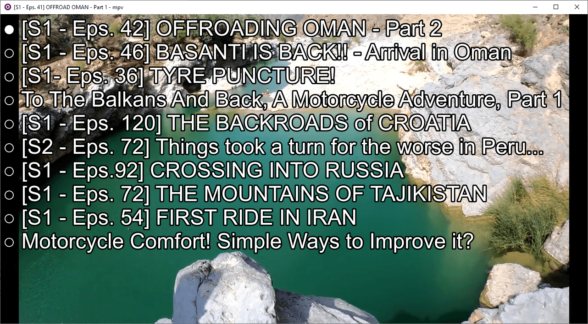

# youtube-upnext
A userscript for MPV that allows you to load the up next/recommened youtube video on the fly, as though you were using the web player.

Toggle the menu with ctrl+u (configurable). Select from the list with the arrow keys (configurable), and press enter (configurable) to select. Menu times out after 10 seconds (configurable.)

## Installation

Copy youtube-upnext.lua into your scripts directory, e.g.:

    cp youtube-upnext.lua ~/.config/mpv/scripts/

optional, copy the config file:

    cp youtube-upnext.conf ~/.config/mpv/script-opts/

### Windows:

Make sure you have GNU Wget installed.
There are several websites that offer a binary release of wget for Windows e.g. [here](https://eternallybored.org/misc/wget/).

If you downloaded/installed the wget executable, you also have to [add the directory of the wget.exe toyour machine's
%PATH](https://stackoverflow.com/a/41895179/10367381)

Depending on your setup you may have to set `check_certificate = false` in the lua script or in the config file,
because some wget versions on Windows seem to have problems with HTTPS/SSL certificates.

## Credit
- I pretty much copied the [mpv-youtube-quality](https://github.com/jgreco/mpv-youtube-quality) script and added wget

## [youtube-quality](https://github.com/jgreco/mpv-youtube-quality)'s Credit
- [reload.lua](https://github.com/4e6/mpv-reload/), for the function to reload a video while preserving the playlist.
- [mpv-playlistmanager](https://github.com/jonniek/mpv-playlistmanager), from which I ripped off much of the menu formatting config.
- ytdl_hook.lua, from which I ripped off much of the youtube-dl code to fetch the format list
- somebody on /mpv/ for the idea